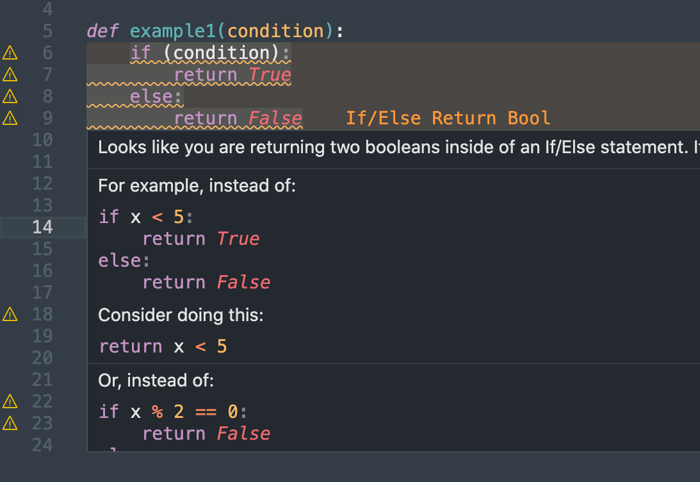

# Deodorant

Deodor Python code smell.

Detect common student anti-patterns in real time. Suggest clean alternatives.

# Authors

- **Jack** - [JKleinsman](https://github.com/JKleinsman)
- **Simon** - [mightbesimon](https://github.com/mightbesimon)
- **Jonathan** - [sson057](https://github.com/sson057)
- **Luke** - [GoldenBaz](https://github.com/GoldenBaz)

# License

Apache-2.0

# Acknowledgements

- **[James Finnie-Ansley](https://github.com/james-ansley)** for their work on [qChecker](https://github.com/james-ansley/qchecker).
- **[openlawlibrary](https://github.com/openlawlibrary)** for their work on [pygls](https://github.com/openlawlibrary/pygls)
- **[Asma Shakil](https://profiles.auckland.ac.nz/asma-shakil)** for organising the capstone course for us.
- [University of Auckland](https://www.auckland.ac.nz/en.html)

# Dev builds instructions

The instructions below are for tinkering with the extension. If you are only using Deodorant as is, you don't need to worry about this section :)

## Stack

Python 3.10 (language server)
 * pygls v0.11.3
 * qChecker v1.0.2

Node and TypeScript (language client)
  * vscode-languageclient v7.0.0

### Install Server Dependencies

1. `python -m venv venv`
1. `pip install -r requirements.txt` from root directory
1. `source venv/bin/activate` on Mac, `.\venv\Scripts\activate` on Windows
1. Create `.vscode/settings.json` file and set `python.defaultInterpreterPath` to point to your python environment where `pygls` is installed

`deactivate` to deactivate the virtual enviroment

### Install Client Dependencies

Open terminal and execute following commands:

1. `npm install`
1. `cd client`
1. `npm install`

### Run Extension

1. Open this directory in VS Code
1. Open debug view (`ctrl + shift + D`)
1. Select `Server + Client` and press `F5`
